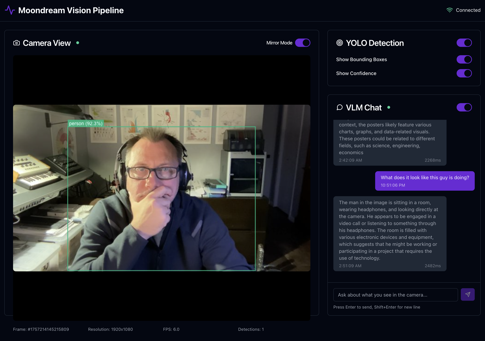

# Vision Pipeline Jetson

A high-performance, fully containerized computer vision pipeline optimized for **NVIDIA Jetson devices**. Features real-time object detection (YOLO11) and Vision Language Model capabilities (Moondream2) with CUDA GPU acceleration for edge computing applications.


## Vision Pipeline in Action



The interface demonstrates the **containerized architecture**: fast YOLO detection (green bounding boxes) providing immediate object recognition, while the VLM chat delivers rich, contextual understanding of the scene. Optimized for NVIDIA Jetson's CUDA acceleration.

## Key Features

### **Fully Containerized Architecture for NVIDIA Jetson**
- **CUDA GPU Acceleration**: YOLO11 and Moondream2 leverage NVIDIA GPU through Docker runtime
- **Complete Containerization**: All services run in Docker with GPU access
- **Edge-Optimized Performance**: ~10-30 FPS YOLO detection, 1-2s VLM responses

### **Real-Time Vision Pipeline**
- **Live Camera Feed**: CSI cameras (IMX219-83 Stereo), USB webcams, IP cameras
- **Interactive Bounding Boxes**: Real-time object detection with confidence scores
- **Natural Language Interface**: Chat with the AI about what it sees
- **Modern Dark UI**: Professional interface optimized for edge deployment

### **Scalable Messaging Architecture**
- **Redis Pub/Sub**: High-performance message bus with frame compression
- **Asynchronous Processing**: Non-blocking pipeline for maximum throughput
- **Modular Design**: Easy integration of additional vision models
- **Performance Monitoring**: Built-in metrics and logging

## System Requirements

### **NVIDIA Jetson Device**
- **JetPack**: 4.6+ (Jetson Nano) or 5.0+ (Xavier/Orin)
- **Memory**: 4GB+ RAM (8GB+ recommended for Xavier/Orin)
- **Storage**: 32GB+ microSD/eMMC (64GB+ recommended)
- **Camera**: CSI camera (IMX219-83 Stereo Binocular), USB webcam, or IP camera
- **GPU**: Automatic NVIDIA CUDA acceleration through Docker runtime

### **Message Flow**
```
Camera → Redis → YOLO11 ───┐
              └→ Moondream ┴→ API → WebSocket → Frontend
                     ↑                         ↓
                     └──── Chat Requests ←─────┘
```

## Usage

### **Control Interface**

**YOLO Detection Panel:**
- **Toggle**: Enable/disable object detection
- **Bounding Boxes**: Show/hide detection overlays  
- **Confidence Scores**: Display detection confidence
- **Real-time Status**: Detection count and processing status

**VLM Chat Interface:**
- **Toggle**: Enable/disable VLM processing
- **Natural Language Chat**: Ask questions about the scene
- **Processing Indicators**: Shows when VLM is analyzing
- **iPhone-style Scrolling**: Conversation history with smooth scrolling

**Camera Controls:**
- **Mirror Mode**: Horizontal flip for selfie-style viewing
- **Connection Status**: Real-time connection indicators
- **Frame Information**: Resolution, FPS, and frame counters

### **Example Chat Interactions**

```
User: "What do you see in this image?"
VLM:  "I can see a person sitting at a desk with a computer setup. 
       There's a keyboard, mouse, and what appears to be a coffee 
       cup on the desk. The person is wearing glasses and appears 
       to be working."

User: "What objects are on the desk?"
VLM:  "On the desk I can identify several objects: a black keyboard,
       a computer mouse, a white coffee mug, some papers or documents,
       and what looks like a smartphone. There's also a computer 
       monitor visible in the background."
```

## Configuration & Optimization

### **Performance Tuning**

**Frame Processing Rates:**
```bash
# Camera capture rate
export CAMERA_FPS=6          # Balanced performance

# YOLO processing (every Nth frame)
export YOLO_FRAME_STRIDE=1   # Process every frame

# VLM processing (every Nth frame)  
export VLM_FRAME_STRIDE=10   # Process every 10th frame
```

**Resource Optimization:**
```bash
# For lower-end hardware
export CAMERA_FPS=3
export YOLO_FRAME_STRIDE=2
export VLM_FRAME_STRIDE=20

# For high-performance setups
export CAMERA_FPS=10
export YOLO_FRAME_STRIDE=1
export VLM_FRAME_STRIDE=5
```

### **Robotics-Specific Settings**

**Multi-Tier Processing:**
```bash
# Reactive tier (< 100ms)
export OBSTACLE_DETECTION_FPS=30
export EMERGENCY_STOP_FPS=60

# Deliberative tier (100ms - 1s)
export OBJECT_CLASSIFICATION_FPS=10
export PATH_PLANNING_FPS=5

# Cognitive tier (1s+)
export SCENE_UNDERSTANDING_FPS=1
export TASK_PLANNING_FPS=0.5
```

## Performance Benchmarks

### **NVIDIA Jetson Performance**

| **Jetson Model** | **YOLO11** | **Moondream2** | **Memory Usage** |
|------------------|------------|----------------|------------------|
| **Nano (4GB)** | 40-60ms | 2-3 seconds | ~2.5GB |
| **Xavier NX** | 20-30ms | 1.5-2 seconds | ~3GB |
| **Xavier AGX** | 15-25ms | 1-1.5 seconds | ~4GB |
| **Orin Nano** | 15-20ms | 1-1.5 seconds | ~3GB |
| **Orin NX/AGX** | 10-15ms | 0.8-1.2 seconds | ~4-6GB |

### **Real-World Performance**
- **Camera Capture**: 10-30 FPS (device dependent, configurable)
- **YOLO Detection**: ~30-100 FPS capable (device dependent)
- **End-to-end Latency**: <50ms (detection), 1-2s (VLM)
- **Concurrent Processing**: Both models run simultaneously with CUDA streams

## Extending the Pipeline

### **Adding New Vision Models**

The modular architecture makes it easy to add new vision models:

```python
# 1. Create new native service (services/native/new_model_native.py)
class NewModelService:
    def __init__(self):
        self.device = "cuda"  # NVIDIA Jetson GPU
        self.frame_stride = 5  # Process every 5th frame
        
    async def process_frame(self, frame, metadata):
        # Your model inference here
        results = await self.model.predict(frame)
        
        # Publish to Redis
        await self.publisher.publish_message(
            "detection.new_model", 
            results
        )

# 2. Add startup script
./scripts/start-native-newmodel.sh
```

### **Recommended Processing Rates for Jetson**

| **Vision Task** | **NVIDIA Jetson Rate** | **Use Case** |
|----------------|------------------------|--------------|
| Object Detection | 30-60 FPS | Real-time tracking |
| Scene Understanding | 1-3 FPS | Context analysis |
| Facial Recognition | 10-20 FPS | Human interaction |
| Text/OCR | 2-5 FPS | Document processing |
| Depth Estimation | 10-30 FPS | Spatial analysis |

## Project Structure

```
Vision-Pipeline-Jetson/
├── services/
│   ├── api/                 # FastAPI + WebSocket server
│   ├── cv_services/         # CUDA-accelerated computer vision services
│   │   ├── camera_service.py
│   │   ├── yolo_service.py
│   │   └── moondream_service.py
│   ├── message_bus/         # Redis pub/sub implementation
│   └── shared/              # Common models and utilities
├── frontend/                # React + TypeScript UI
├── containers/              # Dockerfiles for containerized services
├── scripts/                 # Management and deployment scripts
├── docs/                    # Architecture and API documentation
├── models/                  # Model storage (gitignored)
│   ├── moondream/           # Moondream2 VLM
│   ├── yolo/                # YOLO11 models
│   └── jetson_models/       # Optimized models for Jetson
└── docker-compose.yml       # Hybrid architecture orchestration
```

## Monitoring & Debugging

### **Real-time Monitoring**
```bash
# Unified log viewer
./scripts/logs-unified.sh

# Service-specific logs
tail -f logs/camera_native.log
tail -f logs/yolo_native.log
tail -f logs/moondream_native.log

# Redis message monitoring
docker exec moondream-redis redis-cli MONITOR

# Performance metrics
./scripts/status.sh
```

### **Common Issues & Solutions**

**Camera Not Detected:**
```bash
# Check camera permissions (Jetson)
# Ensure camera is properly connected to CSI port

# Test CSI camera access
v4l2-ctl --list-devices
gst-launch-1.0 nvarguscamerasrc ! nvoverlaysink

# Try different camera indices
export CAMERA_INDEX=0  # CSI camera usually 0
```

**GPU Not Accessible:**
```bash
# NVIDIA Jetson - verify CUDA
nvidia-smi
jetson_clocks --show

# Test CUDA in container
docker run --runtime=nvidia --rm nvcr.io/nvidia/l4t-pytorch:r35.2.1-pth2.0-py3 python3 -c "import torch; print(torch.cuda.is_available())"
```

**Model Loading Failures:**
```bash
# Check model files
ls -la models/moondream/moondream2/
ls -la models/yolo/

# Verify disk space
df -h

# Re-download models
rm -rf models/moondream/moondream2
cd models/moondream && git clone https://huggingface.co/vikhyatk/moondream2
```

## Deployment Options

### **Development Mode**
```bash
# Quick start (minimal output)
./scripts/quick-start.sh

# Full start with detailed output
./scripts/start-all.sh
```

### **Production Mode**
```bash
# Optimized for performance
export CAMERA_FPS=10
export YOLO_FRAME_STRIDE=1
export VLM_FRAME_STRIDE=5
./scripts/start-all.sh
```

### **Resource-Constrained Mode**
```bash
# For Jetson Nano or limited memory
export CAMERA_FPS=3
export YOLO_FRAME_STRIDE=2
export VLM_FRAME_STRIDE=15
./scripts/start-all.sh
```

## Contributing

We welcome contributions! This project demonstrates high-performance computer vision on NVIDIA Jetson edge devices.

**Priority Areas:**
- Additional vision models (depth estimation, segmentation, pose detection)
- Multi-camera support for CSI + USB cameras
- Performance optimizations for different Jetson models
- UI/UX improvements for the React frontend
- TensorRT optimization and quantization

**Development Process:**
1. Fork the repository
2. Create a feature branch (`git checkout -b feature/amazing-feature`)
3. Test on your NVIDIA Jetson device
4. Commit changes (`git commit -m 'Add amazing feature'`)
5. Push to branch (`git push origin feature/amazing-feature`)
6. Open a Pull Request

## Documentation

- **[Architecture Overview](docs/ARCHITECTURE.md)**: Hybrid vs container deployment
- **[Messaging Backend](docs/MESSAGING_BACKEND.md)**: Redis pub/sub and performance optimization
- **[API Documentation](http://localhost:8000/docs)**: Interactive API explorer (when running)

## Acknowledgments

- **[Moondream2](https://github.com/vikhyat/moondream)** by Vikhyat Korrapati - Exceptional VLM model
- **[Ultralytics YOLO11](https://github.com/ultralytics/ultralytics)** - State-of-the-art object detection
- **[shadcn/ui](https://ui.shadcn.com/)** - Beautiful, accessible UI components
- **OpenCV, PyTorch, Redis communities** - Foundation technologies

## License

This project is licensed under the MIT License - see the [LICENSE](LICENSE) file for details.

## Support & Community

- **Issues**: [GitHub Issues](https://github.com/DWestbury-PP/Vision-Pipeline-Jetson/issues)
- **Discussions**: [GitHub Discussions](https://github.com/DWestbury-PP/Vision-Pipeline-Jetson/discussions)
- **Documentation**: [Project Wiki](https://github.com/DWestbury-PP/Vision-Pipeline-Jetson/wiki)

---
