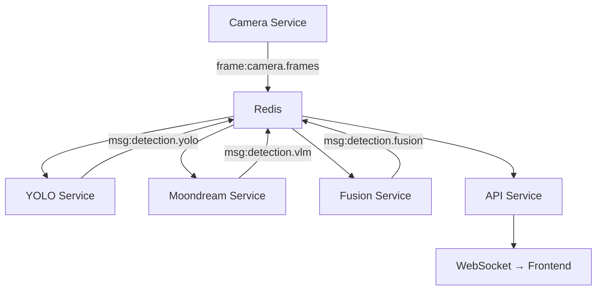
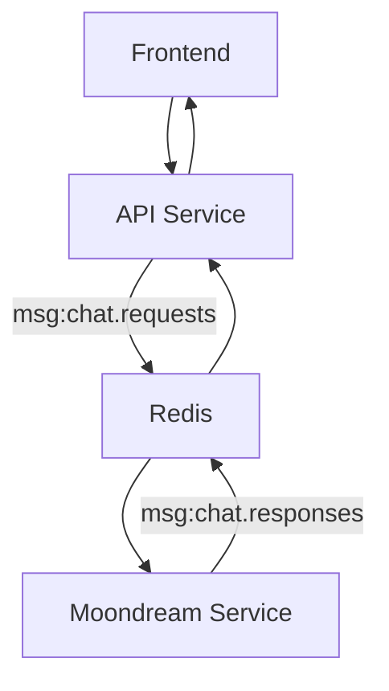

# Moondream Vision Pipeline - Messaging Backend Architecture

## Overview

The Moondream Vision Pipeline uses a **Redis-based pub/sub messaging system** designed for high-performance, real-time computer vision processing. This architecture supports the dual-channel approach required for robotics applications: **fast reactive channels** (YOLO) and **deep analytical channels** (VLM).

## Message Bus Architecture

### Core Design Principles

1. **Asynchronous Processing**: All services operate asynchronously to maximize throughput
2. **Frame Compression**: Automatic gzip compression for efficient network transmission
3. **Stride-Based Processing**: Different services process frames at different rates
4. **Separation of Concerns**: Distinct channels for different data types
5. **Scalability**: Easy addition of new vision processing stages

### Redis Channel Structure

The system uses **prefixed channels** to organize message types:

```
frame:*     - Raw frame data (binary, compressed)
msg:*       - JSON messages (metadata, results, commands)
```

## Channel Topology

### 📹 **Frame Channels**
```
frame:camera.frames     - Raw camera frames (6 FPS)
```
- **Publisher**: Camera Service (native)
- **Subscribers**: YOLO Service, Moondream Service
- **Data Format**: Compressed numpy arrays with metadata
- **Optimization**: Gzip compression (level 1 for speed)

### 🎯 **Detection Channels**
```
msg:detection.yolo      - YOLO bounding boxes (~6 FPS)
msg:detection.vlm       - VLM descriptions (~0.6 FPS)  
msg:detection.fusion    - Combined results
```
- **Publishers**: YOLO Service, Moondream Service, Fusion Service
- **Subscribers**: API Service, Fusion Service
- **Data Format**: JSON with structured detection results

### 💬 **Chat Channels**
```
msg:chat.requests       - User chat messages
msg:chat.responses      - VLM chat responses
```
- **Publishers**: API Service (requests), Moondream Service (responses)
- **Subscribers**: Moondream Service (requests), API Service (responses)
- **Data Format**: JSON with chat context and frame references

### 📊 **System Channels**
```
msg:system.status       - System health metrics
msg:service.status      - Individual service status
msg:system.configuration - Runtime configuration updates
```

## Performance Optimizations

### 🚀 **Frame Processing Rates**

| Service | Frame Rate | Stride | Purpose |
|---------|------------|--------|---------|
| **Camera** | 6 FPS | 1 | Base frame capture rate |
| **YOLO** | 6 FPS | 1 | Real-time object detection |
| **Moondream** | 0.6 FPS | 10 | Deep scene understanding |
| **API/UI** | 6 FPS | 1 | Real-time display |

### 📦 **Data Compression**

**Frame Data:**
```python
# Automatic compression for frame transmission
frame_bytes = gzip.compress(frame_data.tobytes(), compresslevel=1)
```
- **Compression Level**: 1 (fast compression, ~70% size reduction)
- **Trade-off**: Optimized for speed over maximum compression
- **Benefit**: Reduces Redis memory usage and network bandwidth

**Message Data:**
```python
# JSON serialization for structured data
message_data = message.json().encode('utf-8')
```

### ⚡ **Asynchronous Processing**

**Thread Pool Execution:**
```python
# YOLO inference in thread pool to avoid blocking
results = await loop.run_in_executor(None, self._run_inference, frame)
```

**Separate PubSub Connections:**
```python
# Dedicated connections prevent blocking
self.frame_pubsub = self.redis_client.pubsub()  # For frames
self.chat_pubsub = self.redis_client.pubsub()   # For chat
```

## Current Message Flow

### 🔄 **Primary Vision Pipeline**



### 💬 **Chat Pipeline**



## Adding New Vision Processing Models

### 🔧 **Integration Pattern**

1. **Create Service Class**
```python
class NewVisionService:
    def __init__(self):
        self.subscriber = MessageBusSubscriber(RedisMessageBus())
        self.publisher = MessageBusPublisher(RedisMessageBus())
        
    async def start(self):
        await self.subscriber.subscribe_frame(
            Channels.CAMERA_FRAMES, 
            self._process_frame
        )
```

2. **Define Processing Rate**
```python
# Add to config.py
new_vision_frame_stride: int = Field(default=5, env="NEW_VISION_FRAME_STRIDE")
```

3. **Create Output Channel**
```python
# Add to base.py Channels class
NEW_VISION_RESULTS = "detection.new_vision"
```

4. **Implement Processing**
```python
async def _process_frame(self, frame: np.ndarray, metadata: FrameMetadata):
    # Skip frames based on stride
    if self.frame_counter % self.frame_stride != 0:
        return
        
    # Run inference
    results = await self._run_inference(frame)
    
    # Publish results
    await self.publisher.publish_message(
        Channels.NEW_VISION_RESULTS,
        detection_message
    )
```

### 🎯 **Recommended Processing Rates for Robotics**

| Processing Type | Suggested Rate | Use Case |
|----------------|---------------|----------|
| **Obstacle Detection** | 10-30 FPS | Navigation safety |
| **Object Recognition** | 5-10 FPS | Task planning |
| **Scene Understanding** | 1-2 FPS | Context awareness |
| **Facial Recognition** | 2-5 FPS | Human interaction |
| **Text/OCR** | 0.5-1 FPS | Information extraction |
| **Depth Estimation** | 5-15 FPS | Spatial reasoning |

## Robotics-Specific Optimizations

### 🤖 **Multi-Tier Processing Architecture**

**Tier 1: Reactive (< 100ms)**
- Obstacle detection
- Emergency stop triggers
- Basic object tracking

**Tier 2: Deliberative (100ms - 1s)**
- Object classification
- Path planning inputs
- Gesture recognition

**Tier 3: Cognitive (1s+)**
- Scene understanding
- Task planning
- Natural language processing

### 🔧 **Scalability Considerations**

**Horizontal Scaling:**
```python
# Multiple instances with load balancing
YOLO_INSTANCES = 3
MOONDREAM_INSTANCES = 2
```

**Priority Queues:**
```python
# High-priority channels for safety-critical data
PRIORITY_CHANNELS = [
    "detection.obstacles",
    "detection.emergency",
    "control.stop"
]
```

**Resource Management:**
```python
# GPU memory management for multiple models
torch.cuda.set_per_process_memory_fraction(0.3)  # Per service
```

## Performance Monitoring

### 📊 **Key Metrics**

**Throughput Metrics:**
- Frames processed per second
- Message queue depths
- Processing latency per service

**Resource Metrics:**
- Redis memory usage
- GPU utilization
- Network bandwidth

**Quality Metrics:**
- Detection accuracy
- False positive rates
- Response times

### 🔍 **Monitoring Implementation**

```python
# Built-in performance logging
if self.frames_processed % 30 == 0:
    log_performance_metrics(
        self.logger,
        "frame_processing",
        processing_time,
        frame_id=metadata.frame_id,
        model_name="yolo11n"
    )
```

## Future Enhancements

### 🚀 **Planned Improvements**

1. **Dynamic Frame Rates**: Adaptive processing based on scene complexity
2. **Priority Routing**: Critical detections bypass normal queues
3. **Model Switching**: Runtime model selection based on requirements
4. **Distributed Processing**: Multi-node deployment for high-throughput
5. **Edge Optimization**: Quantized models for resource-constrained environments

### 🎯 **Robotics Integration Roadmap**

1. **Phase 1**: Add depth estimation and obstacle detection
2. **Phase 2**: Implement spatial reasoning and mapping
3. **Phase 3**: Add multi-modal sensor fusion (lidar, IMU)
4. **Phase 4**: Real-time decision making and control loops

This messaging architecture provides the foundation for a sophisticated robotics vision system, balancing real-time performance with deep analytical capabilities.
